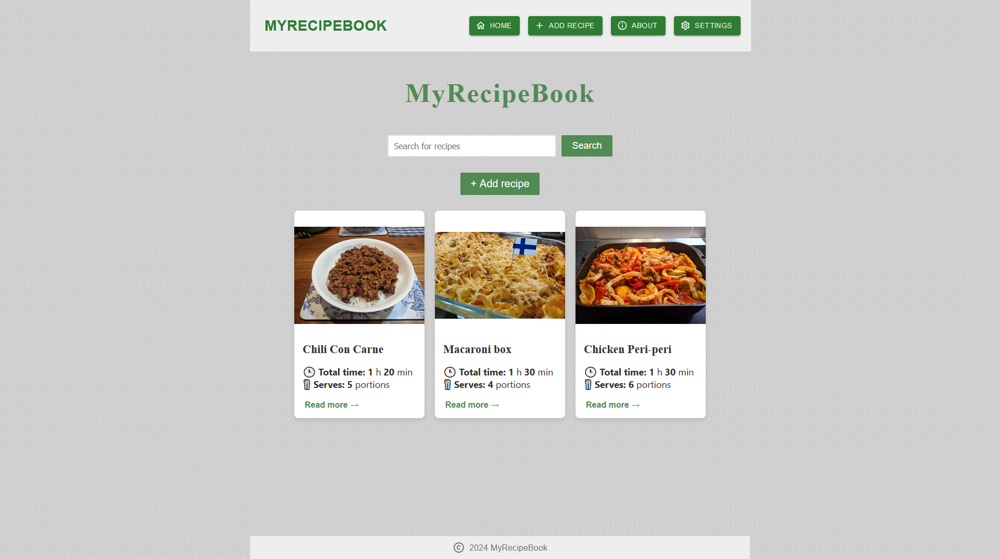

# MyRecipeBook


## Demo link

`Add link to here when we have it`

## Table of Content
1. [About the Web application](#about-the-web-application)
2. [Screenshots](#screenshots)
3. [Technoliges](#technoliges)
4. [Setup](#setup)
5. [Approach](#approach)
6. [Licence](#licence)
7. [Learn More](#learn-more)


## About the Web application

MyRecipeBook is a web application made for displaying recipes while using measurements customised to your preference. At the same time, users are able to share their recipes to this website.

User group:
- People who are willing to share their recipes to others
- People who enjoy cooking
- People who are willing to try new recipes

## Screenshots



## Technologies

<!-- # Getting Started with Create React App -->
- **Front-end**
  - **React**: For building the user interface and front-end.
  - **Material UI**: For implementing pre-designed UI components and ensuring consistent styling across the application.
  - **Figma**: Used for designing wireframes the user interface.
- **Back-end**
  - **Node.js and Express**: For back-end services.
  - **Multer**: For file management
  - **MongoDB and Mongoose**: For database management.

<!-- This project was bootstrapped with [Create React App](https://github.com/facebook/create-react-app). -->

## Setup

Perform the tasks below to run your own local version of MyRecipeBook

### - Download and extract the project

### - Install dependancies

Using a code terminal in your editor of choice, run 'npm install' in both the frontend and backend folder (use 'cd frontend' and 'cd backend' respectively to navigate to these folders)

### - Set up MongoDB database
- Initial database setup
  - This project uses a MongoDB atlas database to function, set up an account [here](https://www.mongodb.com/products/platform/atlas-database)
  - Once signed in, follow the sidebar to Database -> Clusters and create a database cluster
  - From that new cluster, click on 'connect' then connect by 'drivers', copy the connection link below for later
- Setting up the user
  - From the sidebar, go to Security -> Database Access and 'Add new database user'
  - Give the user any username or password of your choice, take note of these for later
- Setting up the database collection
  - In your cluster, click on "Create Database"
  - Enter the database name of your choice (e.g. "RecipeBook") and the collection name 'recipes'. Leave the preference selection as is.
- Setting up the API connection to the collection
  - In your backend directory (in the same directory as app-server.js), add a new file: mongoose-connect-api.js
  - Add the following code to this file:
```
const mongoose = require('mongoose');
function ConnectMongooseDBAPI(expressAPI, PORT) {
    mongoose.connect('CONNECTION')
.then(() => {
    expressAPI.listen(PORT);
}).catch((err) => {
    console.log(err);
});
}
exports.ConnectMongooseDBAPI = ConnectMongooseDBAPI;
```
  - Where it is marked CONNECTION, place the connection string obtained in the initial database setup,:
  - Replace <db_username> and <db_password> with the username and password you generated in the 'Setting up the user' step
  - Just before '?retryWrites', add the name of your database created in the 'Setting up the database collection' step

Your database should now be ready to go

### - Starting the application
- In two separate terminals, navigate to the frontend and backend respectively ('cd frontend' etc)
- Run 'npm start' in each terminal, starting with the backend.
- The web application should begin running on localhost:3000 (with the backend running on localhost:5000 in the background)


## Approach
This project followed an **Agile** development methodology, with **daily scrum** meetings to ensure progress and collaboration. The team was divided into three roles: **Product Owner**, **Scrum Master**, and **Developers**. 

We completed the project over **2 sprints**, each lasting **2 weeks**, focusing on delivering a **Minimum Viable Product (MVP)**.

### Design
The design phase began by creating wireframes via **Figma** based on the requirements provided by the Product Owner. This allowed us to visualize the user interface and the essential features for the MVP. These wireframes guided the development of both the frontend and backend, ensuring alignment with the project's goals.

### Development
#### Frontend:

The frontend was developed as a **Single Page Application (SPA)**  using **React**, implementing component-based architecture for reusability and maintainability.

We adhered to the **Single Responsibility Principle** by ensuring each component had a specific function, improving clarity and making the code easier to test.

<!-- Code styles followed ESLint and Prettier for consistent formatting and clean code. -->

#### Backend:

The backend was designed to follow the REST API pattern, keeping the services modular and easy to extend.
We used MVC (Model-View-Controller) as the primary design pattern to separate business logic from presentation and routing, ensuring a clean architecture.

#### Integration & Deployment:

After completing individual features, we integrated the frontend and backend, ensuring smooth communication via API endpoints.


<!-- We used a continuous integration (CI) process for testing and automated deployment to ensure the code worked across all environments. -->

#### Version Control and Code Management

We used **Github** for **version control**, following a branch-based workflow to manage feature development, code reviews, and merge requests. This ensured that the codebase remained stable throughout the project.


## Licence
This project is licensed under the MIT License - see the [LICENSE](LICENSE) file for details.


## Learn More

You can learn more in the [Create React App documentation](https://facebook.github.io/create-react-app/docs/getting-started).

To learn React, check out the [React documentation](https://reactjs.org/).

### Code Splitting

This section has moved here: [https://facebook.github.io/create-react-app/docs/code-splitting](https://facebook.github.io/create-react-app/docs/code-splitting)

### Analyzing the Bundle Size

This section has moved here: [https://facebook.github.io/create-react-app/docs/analyzing-the-bundle-size](https://facebook.github.io/create-react-app/docs/analyzing-the-bundle-size)

### Making a Progressive Web App

This section has moved here: [https://facebook.github.io/create-react-app/docs/making-a-progressive-web-app](https://facebook.github.io/create-react-app/docs/making-a-progressive-web-app)

### Advanced Configuration

This section has moved here: [https://facebook.github.io/create-react-app/docs/advanced-configuration](https://facebook.github.io/create-react-app/docs/advanced-configuration)

### Deployment

This section has moved here: [https://facebook.github.io/create-react-app/docs/deployment](https://facebook.github.io/create-react-app/docs/deployment)

### `npm run build` fails to minify

This section has moved here: [https://facebook.github.io/create-react-app/docs/troubleshooting#npm-run-build-fails-to-minify](https://facebook.github.io/create-react-app/docs/troubleshooting#npm-run-build-fails-to-minify)
